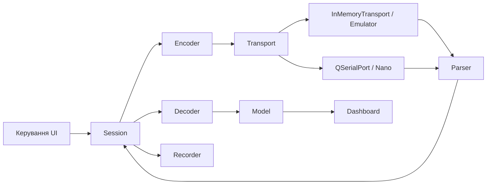

# Архітектура M0/M1 та M2a

M2a додає незалежну стандартну C++20 бібліотеку `hondadash_dlc`:
`dlc::Session → encoder → OfflineLink → ScriptedHondaEcu → fragmented RX →
parser → profile decoder → Model → widgets/Recorder`. Honda Session не
приймає transport-параметр і структурно не може відкрити COM. Спільними
лишаються optional measurements, RawEvent, widgets і bounded recording.
Деталі: [HONDA_DLC_PROTOCOL.md](HONDA_DLC_PROTOCOL.md).

Sample має updatedMask (усі канали за замовчуванням для M0/M1), source,
reasons та політику числового діапазону. Незмінені канали не змінюють
lastValid/quality/host IDs. DecoderValidated допускає скінченні значення
поза demo-шкалою. Графік має окрему bounded історію кожного каналу; пропущений
bit не додає старого значення як нове. M2a recording v3 явно додає partial
semantics і per-channel ages; формат synthetic v2 збережено.

Нижче описано збережений synthetic шлях M0/M1, з його власним HELLO/CRC/IDs.
Ці правила не переносяться в Honda DLC.

Настільний C++20 Session не залежить від Qt, Windows API або Emulator.
Він отримує Transport за посиланням; transport живе довше за Session.
Усі операції сесії/транспорту виконує один потік. Qt SerialPort 6.8.3
належить тільки бібліотеці hondadash_serial; UI використовує Widgets.

## Стан і часові межі

Stopped → Opening → BootWaiting → Handshaking (HELLO + INFO) → Running.
Невідновна помилка переводить у Faulted і закриває transport. Припинення
не запускає інший порт або автоматичну програмну симуляцію.

USB UI задає bootDelayMs=2000; in-memory — 0. handshakeDeadlineMs=5000
охоплює відкриття, запуск та обидві перевірки. HELLO має до трьох спроб,
без повторного відкриття порту. timeoutMs=300 — бюджет відповіді одного
запиту, pollMs=100 — інтервал snapshot. txTimeoutMs=500 починається від
прийняття кадру локальною TX-чергою. Response timeout починається лише
після спорожнення власної черги та Qt bytesToWrite; це не ACK пристрою.
TX timeout завершує сесію, тому недовідправлений кадр не перекривається
наступним. Timeout snapshot дозволяє наступне опитування; timeout control
або INFO завершує сесію з видимою невизначеністю стану команди.

Один pending request спільний для HELLO, INFO, controls та READ. Чотири
слоти desired state об'єднують часті зміни до останніх значень; revisions
зберігають зміни, що прийшли під час очікування ACK. Controls чергуються
з належними snapshot, щоб не витісняти опитування. ACK не є вимірюванням.
Непідтримувані capability команди не відправляються; UI їх вимикає.

Stop/reset очищує parser, pending та модель до NoData. Start закриває
старий transport і створює нову identity. Callbacks мають generation і
weak lifetime guard; callback попереднього запуску або знищеного Session
не діє. SerialTransport додатково створює новий QSerialPort на кожен Start.

Session ID — ненульовий 32-bit лічильник із випадковим початком процесу
(std::random_device); генератор ін'єктується в тестах. Це зменшує ризик
збігу після перезапуску, але не є криптографічним доказом або абсолютною
гарантією у просторі 32 bit. Повтор попередньої identity/нуль відхиляється.
Request ID зростає без wrap; вичерпання вимагає перепідключення.
Error 3 після reset endpoint викликає нову identity та HELLO на відкритому
порту; підтверджені одноразові faults повторно не озброюються.

## Обмеження та serial I/O

Serial: 115200, 8N1, no flow control; власний TX ≤256, Qt TX ≤128 байтів,
Qt RX buffer ≤4096. Один write на pump, RX до1024 байтів за callback,
фрагменти ≤256. Частковий/нульовий write продовжується асинхронно через
bytesWritten/таймер; blocking wait, sleep/processEvents відсутні.
Помилки параметрів, доступу, переповнення й I/O видимі та закривають порт.
DTR установлюється один раз після відкриття, RTS=false; це може reset Nano.
Відсутність modem control на PTY має окрему діагностику; політика DTR
не гарантує однакового reset для всіх USB-перетворювачів.

InMemoryTransport окремо володіє Emulator і фрагментами доставки; межа256
фрагментів, переповнення завершує сесію. Він також реалізує M1 controls
і duplicate policy. Embedded Endpoint використовує фіксовані буфери79/158,
без heap; його endpoint.cpp збирається C++11 для AVR і для host tests.

## Модель, UI і журнал

Model та прилади M0 збережено: сім optional каналів, NoData/Valid/Stale/
Unsupported/Invalid, stale після1000мс, приховування після3000мс. UI
показує лише прийнятий snapshot; графік обмежений і з розривами без даних.
Час firmware millis() і монотонний час ПК мають різні початки; timestamp
вимірювання — час отримання на ПК. Системний час потрібен лише журналу.

Recorder має bounded256 worker queue; disk I/O поза GUI. Переповнення,
open/write помилки видимі. UTF-8 CSV та JSONL з decimal point незалежним
від locale. Порожнє value означає відсутність; нуль залишається числом.

Format_version=2, app_version=0.3.0, source=simulation завжди, навіть USB.
Метадані: profile, scenario/seed на початку запису, transport(in-memory/
serial), endpoint, firmware, port, baud, created_unix_ms, clock, units.
Початок запису до handshake має endpoint=unrecognized; ready event згодом
фіксує розпізнану identity. Зміни controls видно у TX/ACK raw events.
TX_QUEUED — намір Session передати кадр; TX — точні байти, прийняті I/O;
TX_DRAINED — черги спорожнені; RX — всі фрагменти до parser, включно
з пошкодженими. ACK пристрою залишається окремою протокольною відповіддю.
