# Архітектура M0

Усе виконується в одному застосунку. In-memory транспорт доставляє
реальні байти фрагментами; окремий процес, TCP або віртуальний COM
не потрібні. Внутрішня логіка не залежить від GUI.

```mermaid
flowchart LR
  Timer[Qt timer: monotonic tick] --> Session[Session: one pending request]
  Session --> Encode[Request encoder]
  Encode --> Transport[Bounded in-memory deliveries]
  Transport --> ECU[Synthetic ECU request parser]
  ECU --> Response[Encoded response]
  Response --> Fragments[Fragmented byte deliveries]
  Fragments --> Parser[Stream parser and checksum]
  Parser --> Match[Session/request match]
  Match --> Decode[Snapshot decoder]
  Decode --> Model[Per-channel model]
  Model --> UI[QPainter dashboard]
  Decode --> CSV[Recorder CSV worker]
  Session --> Raw[Recorder raw JSONL worker]
  Controls[UI controls] --> ECU
```

## Компоненти й залежності

| Каталог | Відповідальність | Залежності |
|---|---|---|
| `core` | Семантика каналів, одиниці, optional значення, достовірність і свіжість | стандартний C++20 |
| `protocol` | Wire frame, CRC, payload encode/decode, обмежений потоковий парсер | core, C++20 |
| `emulator` | Сценарії, seed, ручний стан, байтові відповіді та fault injection | core/protocol, C++20 |
| `application` | HELLO, polling, deadline, session/request identity, доставка фрагментів | core/protocol/emulator, C++20 |
| `recording` | Унікальна папка, метадані, CSV/JSONL, bounded worker queue | core/application event types, C++20/threads |
| `ui` | Qt timers, controls, layouts, tachometer, cards, plot, CLI smoke | усі бібліотеки, Qt Widgets |

Сесія створює байтовий HELLO перед READ_SNAPSHOT. Максимум один запит
очікує відповідь; polling не накопичує запити під час затримки.
HELLO має максимум три спроби, deadline запиту — 300 мс, нормальний
інтервал READ_SNAPSHOT — 100 мс. Після тайм-ауту snapshot не ретранслюється
як той самий запит: наступне опитування має новий request id.
Пізні, повторні й старі session id відкидаються.

Фізичний час у session/model передає caller як `Time` у монотонних мс.
UI отримує його через QElapsedTimer. Системна дата потрібна лише для
іменування/метаданих файлів; зміна дати не змінює timeout чи freshness.
Stop прибирає pending запит і deliveries; новий Start створює іншу сесію.

## Модель і відображення

Кожен канал зберігає optional число, Quality, час останнього Valid,
session/request id і source. `NoData`, `Unsupported`, `Invalid` мають
окрему семантику. `Valid` після 1000 мс без коректного оновлення стає
`Stale`; після 3000 мс current повертає відсутність, а останнє вимірювання
залишається доступним для діагностики. Обидва пороги — іменовані settings.

Час кадру віджета не є часом вимірювання. Стрілка інтерполює лише
відображення прийнятого значення, а цифрові числа й CSV використовують
декодовані значення. Графік зберігає обмежену історію приблизно 60 с
і залишає розрив на відсутніх даних. Частота даних 10 Гц і таймер
анімації приблизно 16 мс — окремі налаштування.

## Запис

Start запису асинхронно відкриває унікальну `recording-<unix-ms>-<suffix>`
папку всередині вибраної користувачем папки. `start()` повідомляє
прийняття операції; відкриття файлів та подальші помилки worker видно
через `status()`/`error()`. Диск не виконує роботу у Qt event loop.
Stop запису дренує прийняті елементи, flush/close і join; так само
працює завершення вікна. Черга має 256 елементів за замовчуванням.
Повна черга зупиняє приймання й показує помилку; прийняті елементи
дренуються. Помилка запису зупиняє worker і залишається видимою.

Файли UTF-8, LF, decimal point `.` незалежно від Windows locale:

- `measurements.csv`: перший рядок `# <metadata JSON>`, далі header і
  `time_ms,session_id,request_id`, потім value/state для кожного каналу.
  Порожнє value означає відсутність; нуль залишається `0`.
- `raw.jsonl`: перший рядок metadata, потім одна JSON подія на рядок:
  `time_ms`, `session_id`, `request_id`, `kind`, `detail`, `bytes_hex`.
  TX/RX містять точні фрагменти; шум і пошкоджені RX також зберігаються.

Метадані: `format_version=1`, `app_version=0.1.0`, `source=simulation`,
`profile=synthetic-demo-v1`, scenario, seed, `created_unix_ms`,
`clock=monotonic_ms`, одиниці `rpm,km/h,degC,degC,%,kPa,V`.
`time_ms` не є Unix timestamp. Replay UI ще не реалізовано; записи
зберігають порядок та фрагментацію для подальшого відтворення.

## Подальша заміна транспорту

Майбутній USB/Nano adapter повинен доставляти фрагменти байтів через
той самий session/parser шлях. Підтверджений Honda protocol/profile
додається окремо від synthetic-demo-v1. Прилади, freshness модель
та recording API не повинні залежати від COM-порту чи конкретного ECU.
